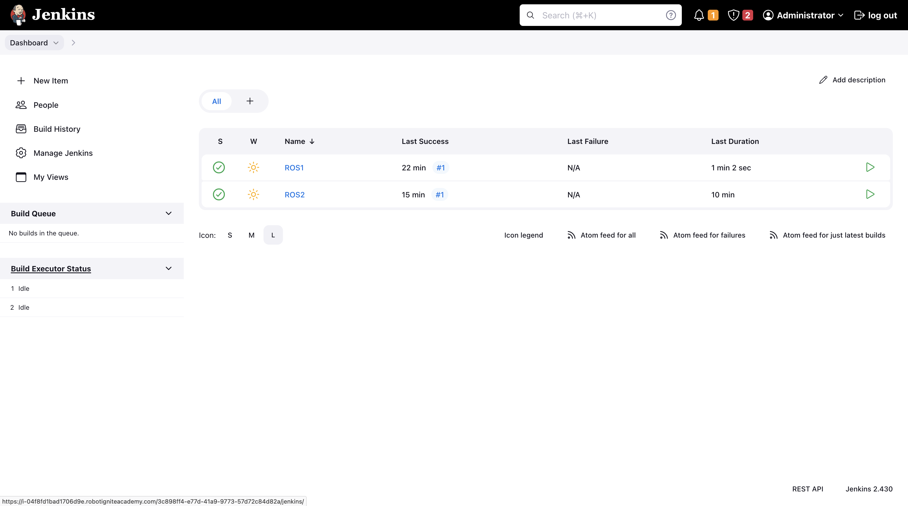

## ROS1 Jenkins

In software engineering, DevOps (Development and Operations) refers to the practices and methodologies used to streamline the development, deployment, and maintenance. Jenkins is one such popular open-source automation server used in DevOps practices, including in robotics.

Jenkins is used to setting up automated workflows to ensure that changes to the codebase are tested and integrated smoothly, leading to more efficient development and deployment processes.

  

## Structure

```text
.
├── ros1
│   └── gazebo
│       ├── Dockerfile
│       └── ros_entrypoint.sh
├── Jenkinsfile
├── Makefile
├── README.md
└── start_jenkins.sh
```

The project contains two branches, one for `noetic` distribution and a second for `galactic` distribution.

```text
- ros1 # noetic
- ros2 # galactic
```

## Setup

A `Makefile` is a script used in software engineering to automate the process, to execute the `Makefile` open the terminal and execute the following commands for root of the project directory.

#### Verify

```bash
# check if you are on correct branch
$ git branch
*ros1
```

#### Install

```bash
# install and setup docker
$ make setup-docker
```

```bash
# setup terminal
$ make setup-tty
```

```bash
# install, setup or start jenkins
$ make setup-jenkins
```

**Note:** In case installation of `Docker` and `Jenkins` is already done in the past the above steps in not needed.

## Jenkins

```bash
# find the web address for jenkins
$ jenkins_address
```

```bash
# alternative
$ cat ~/jenkins__pid__url.txt
```

```bash
# find login credentials
$ cat ~/jenkins__login.txt
```

#### Login

To access the `Jenkins` server open the web address in a new tab and log in to the server using credentials.



**Note:** The server contains two pipelines `ROS1` and `ROS2`, one for each branch `ros1` and `ros2` as `SCM poll` build triggers.

## Pull Request

```bash
# create a new branch from base branch
$ git checkout -b ros1 ros1-modified
```

```bash
# create new generic file
$ touch .gitignore
```

```bash
# commit changes to new branch
$ git commit -am "test: check jenkins build via pr"
```

**Note:** Create a pull request from `ros1-modified` to `ros1`.

## Tools

System tool/modules used for project development.

- `Applications` : [vs-code](https://code.visualstudio.com/), [ros-extensions](https://marketplace.visualstudio.com/items?itemName=ms-iot.vscode-ros) and [docker-desktop](https://docs.docker.com/get-docker/).
- `ROS` : [ros-docker-images](https://hub.docker.com/_/ros/) (`galactic`, `noetic`) or [build-source](https://www.ros.org/blog/getting-started/).

## License

Distributed under the MIT License. See `LICENSE.txt` for more information.
